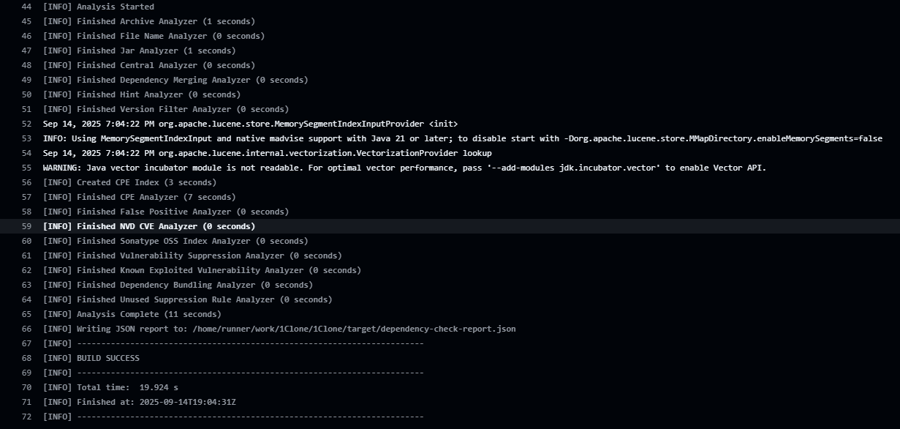
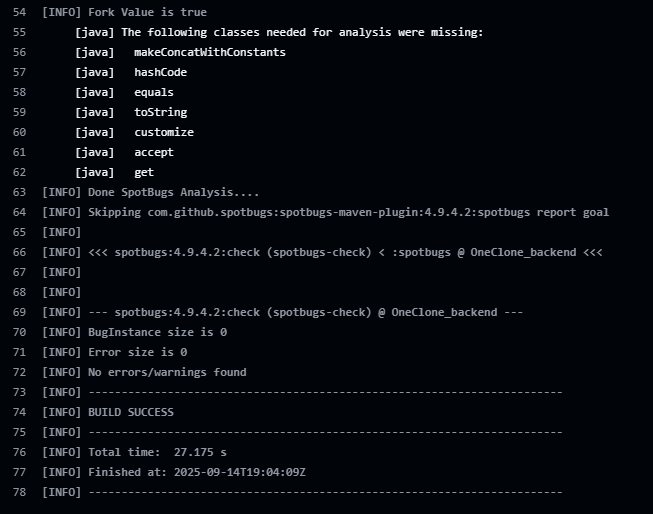

# Security & API README

## 1. Краткое описание проекта

Сервис (Spring Boot, PostgreSQL) предоставляет CRUD/поиск сотрудников, генерацию связанных документов (договор/доп.
соглашение/приложение) на основе DOCX шаблонов, загрузку/выдачу файлов и загрузку сотрудников из Excel. Аутентификация
stateless на JWT (access + refresh). Основные сущности: User, Employee, Document, File.

## 2. Архитектура и ключевые компоненты

- REST контроллеры (`AuthController`, `EmployeeController`, `FileController`, `ExcelController`).
- Слой сервисов (генерация документов `PoiTlDocumentGenerator`, работа с файлами `FileLocationService`, аутентификация
  `AuthServiceImpl`, пользователи `UserServiceImpl`).
- Безопасность: `SecurityConfig`, JWT (`JwtProvider`, `JwtFilter`), XSS фильтр (`XssFilter` +
  `SimpleXssRequestWrapper`).
- Хранилище: PostgreSQL через Spring Data JPA (репозитории). Шаблоны DOCX в `src/main/resources/document_templates`.
- Конфигурация секретов: `secret.properties` (пример — `secret.properties.example`).

## 3. API (эндпоинты)

Все пути приведены без ведущего `/` (базовый URL зависит от деплоя, по умолчанию `http://localhost:8080/`).

### 3.1 Аутентификация

| Метод | Путь          | Описание                 | Тело запроса                               | Ответ                                       | Auth |
|-------|---------------|--------------------------|--------------------------------------------|---------------------------------------------|------|
| POST  | auth/register | Регистрация пользователя | `{"username": "user", "password": "pass"}` | `JwtResponse { accessToken, refreshToken }` | Нет  |
| POST  | auth/login    | Логин                    | `{"username": "user", "password": "pass"}` | `JwtResponse`                               | Нет  |
| POST  | auth/refresh  | Обновление пары токенов  | `{"refreshToken": "<token>"}`              | `JwtResponse`                               | Нет  |

Обе операции возвращают пару токенов. Срок жизни access: 5 минут, refresh: 30 дней.

### 3.2 Сотрудники / Документы

| Метод | Путь                        | Параметры                                             | Описание                                             | Примечания                            | Auth      |
|-------|-----------------------------|-------------------------------------------------------|------------------------------------------------------|---------------------------------------|-----------|
| GET   | employee/all                | Pageable + произвольные query для фильтра             | Постраничный поиск сотрудников                       | Фильтрация через GenericSpecification | Требуется |
| POST  | employee/add                | JSON Employee                                         | Создать сотрудника                                   | companySpecificId генерируется        | Требуется |
| POST  | employee/add-random         | —                                                     | Сгенерировать 100 случайных                          | Dev/тест                              | Требуется |
| POST  | employee/delete             | `id` (query)                                          | Удалить сотрудника                                   |                                       | Требуется |
| PATCH | employee/update             | `id, field, value` (query)                            | Точечное обновление поля                             | Приведение типов внутри switch        | Требуется |
| GET   | employee/objects            | —                                                     | Уникальные объекты работы                            |                                       | Требуется |
| GET   | employee/get-document       | `employeeId, documentType, [dateFrom, dateTo, price]` | Сгенерировать (или получить) документ и вернуть DOCX |                                       | Требуется |
| GET   | employee/get-exist-document | `documentId`                                          | Повторная генерация существующего акта               |                                       | Требуется |

`documentType` принимает значения `CONTRACT`, `ADDITIONAL`, `APPENDIX` (enum `ActType`). При создании `CONTRACT`
автоматически создаются связанное `ADDITIONAL` и `APPENDIX`.

### 3.3 Файлы

| Метод | Путь                    | Параметры                                    | Описание       | Ответ             | Auth      |
|-------|-------------------------|----------------------------------------------|----------------|-------------------|-----------|
| POST  | files/upload            | multipart form: `file`, `owner` (employeeId) | Загрузка файла | `UploadResponse`  | Требуется |
| GET   | files/download/{fileId} | path                                         | Скачать файл   | File resource     | Требуется |
| POST  | files/delete-file       | `id` (query)                                 | Удалить файл   | `ResponseMessage` | Требуется |

### 3.4 Excel

| Метод | Путь                   | Параметры        | Описание                    | Auth                            |
|-------|------------------------|------------------|-----------------------------|---------------------------------|
| POST  | excel/parse            | multipart `file` | Парсинг Excel -> JSON       | Требуется                       |
| POST  | excel/upload-employees | multipart `file` | Импорт сотрудников из Excel | PUBLIC (в текущей конфигурации) |

### 3.5 Форматы DTO для аутентификации

- `JwtRequest { username: string, password: string }`
- `JwtResponse { accessToken: string, refreshToken: string }`
- `RefreshJwtRequest { refreshToken: string }`

### 3.6 Примеры curl

```bash
# Регистрация
curl -X POST http://localhost:8080/auth/register -H "Content-Type: application/json" -d '{"username":"demo","password":"Secret123"}'

# Логин
curl -X POST http://localhost:8080/auth/login -H "Content-Type: application/json" -d '{"username":"demo","password":"Secret123"}'
# Вынесите access в переменную:

# Получить сотрудников (первая страница)
curl -H "Authorization: Bearer {token}" "http://localhost:8080/employee/all?page=0&size=20"

# Генерация договора (если employeeId=1 существует и такого договора нет)
curl "http://localhost:8080/employee/get-document?employeeId=1&documentType=CONTRACT&dateFrom=2025-01-01&dateTo=2025-12-31"
```

## 4. Аутентификация и авторизация

- JWT access + refresh. Генерация: библиотека `io.jsonwebtoken` (секреты base64 из `secret.properties`).
- В access токене (payload) сохраняется `sub` (username) + claim `login`.
- `JwtFilter` извлекает заголовок `Authorization: Bearer <token>`, валидирует подпись и срок, создает `JwtAuth` и
  помещает в `SecurityContext`.
- Разграничение доступа сейчас бинарное (аутентифицирован/нет). Все эндпоинты кроме явно `permitAll()` требуют токен.

## 5. Защита от XSS

Основная защита — экранирование потенциально опасных данных при получении (входящие запросы).
Так же есть защита через заголовки CSP.
К тому же на фронтенде используется React, который по умолчанию экранирует вставляемые данные, и не выполняет их).

1. Фильтр `XssFilter` оборачивает запрос в `SimpleXssRequestWrapper`.
2. `SimpleXssRequestWrapper`:
    - Экранирует параметры, заголовки и строковые поля JSON (используя `HtmlUtils.htmlEscape`).
    - Перечитывает тело JSON и рекурсивно экранирует текстовые значения.
3. Заголовки безопасности в `SecurityConfig`:
    - `X-XSS-Protection: 1; mode=block` (на старых движках IE/Edge Legacy; современные браузеры игнорируют).
    - Content Security Policy: `default-src 'self'; script-src 'self'; object-src 'none'; frame-ancestors 'none';` —
      запрещает внешние скрипты, внедрение объектов и встраивание в iframe.

## 6. Защита от SQL Injection

- Используется Spring Data JPA / Criteria API (`GenericSpecification`) — параметры формируются через CriteriaBuilder,
  что исключает склейку сырого SQL.
- Enum поля преобразуются в константы Java Enum (без прямой подстановки строк в SQL).
- Поисковые запросы `LIKE` формируются через builder.like(...), что параметризуется драйвером.
- Нет ручных `@Query(nativeQuery=true)`.

## 7. Файл конфигурации секретов

`secret.properties.example`:

```
jwt.secret = "<base64>"
jwt.refreshSecret = "<base64>"
```

Секреты должны быть:

- Base64 длиной >= 256 бит.
- Храниться вне репозитория (ENV, Vault, K8s secret).

## 8. SAST / SCA отчеты




## 9. Потоки работы с токенами и файлами

1. Клиент регистрируется / логинится -> получает access + refresh.
2. Access используется в `Authorization: Bearer` для защищённых эндпоинтов.
3. При истечении access клиент вызывает `/auth/refresh` с refresh токеном.
4. Документы формируются на лету из шаблона (подстановка плейсхолдеров) и возвращаются как
   `application/vnd.openxmlformats-officedocument.wordprocessingml.document`.
5. Загрузка файлов: multipart -> сохранение -> выдача через `FileSystemResource`.

## 10. Пароли

- Используется BCrypt (Spring Security `BCryptPasswordEncoder`) не используется соль, но по идее добавляется
  автоматически.
- Минимальная длина пароля при регистрации — 8
